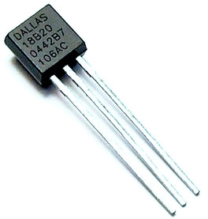

## Thermomètre

- Sonde de température DS18B20
- Bus 1 Wire, développé dans les années 90
  - 3 fils (+5V, masse, data), longeur max : 100 m
  - chaque composant à une adresse unique en 64 bit
  - capteur de pression, porte logique, horloge...

<figure style="margin-left: 450px;  width: 60%">
    
</figure>


## Limite de l'Arduino

- L'arduino est autonome
  - Exemples : relevé de sondes de temperatures et pilotage de radiateur, drône quadricoptère, machine enigma...
  - Contraintes : le programme doit tenir dans 32 Ko de flash et 2 Ko de RAM...

<br>
Dès qu'il s'agit de faire plus intelligent (robot autonome, reconnaissance de voix, débitmètre de tireuse de bière...) une CPU plus puissante va être nécessaire.

<i class="fa fa-arrow-right"></i> Utiliser un ordinateur qui émet des ordres à l'arduino


## Communication basique

- Solution naïve : développer un programme coté ordinateur émettant des ordres au format texte via le port USB à l'arduino
  - Très simple à mettre en oeuvre
  - Ultra documenté
  - Exemple : https://gitlab.com/coliss86/arduino-controller

```
> h
    ___          _       _
   / _ \        | |     (_)
  / /_\ \_ __ __| |_   _ _ _ __   ___
  |  _  | '__/ _` | | | | | '_ \ / _ \
  | | | | | | (_| | |_| | | | | | (_) |
  \_| |_/_|  \__,_|\__,_|_|_| |_|\___/

Help
Command available :
      <pin number [2-9]>=<0,1>
      h - help
      s - i/o status
      t - temperature
```


## Solution plus évoluée

- Sketch Firmata 
  - Libre et open source https://github.com/firmata/arduino
  - Protocole binaire, documenté
  - De nombreux languages ont une lib kivabien &copy; <br>python, perl, ruby, java, php, Haskell, golang, js ...


## Johnny-five

- Lib node.js permettant d'utiliser ce protocole
- Exemple : 

```javascript
var five = require("johnny-five");
var board = new five.Board();

board.on("ready", function() {

  var led = new five.Led(13);

  // "blink" the led in 500ms on-off phase periods
  led.blink(500);
});

```


## Appli de démo

- Client twitter qui réagit au tweet sur #technozaure **~90 lignes de code**
- s'exécute dans un conteneur sur le raspberry 

https://gitlab.com/coliss86/technozaure-arduino

```javascript
var five = require("johnny-five");
var Twitter = require('twitter');
var board = new five.Board();
var client = new Twitter({...});
...
board.on("ready", function() {
  var ledPins = [2,4,5,6,7,8,9,10,11,12];
  var leds = new five.Leds(ledPins);
...
  client.stream('statuses/filter', {track: '#technozaure'},  function(stream){
    stream.on('data', function(tweet) {
      console.log(tweet.text);
      board.wait(60, function(){
        leds.each(function(led, index) {
        led.on();
      });
    });
  });
});

```


## Démo

<figure style="margin-top: 0%; margin-left: 15%; width: 70%">
    
</figure>

