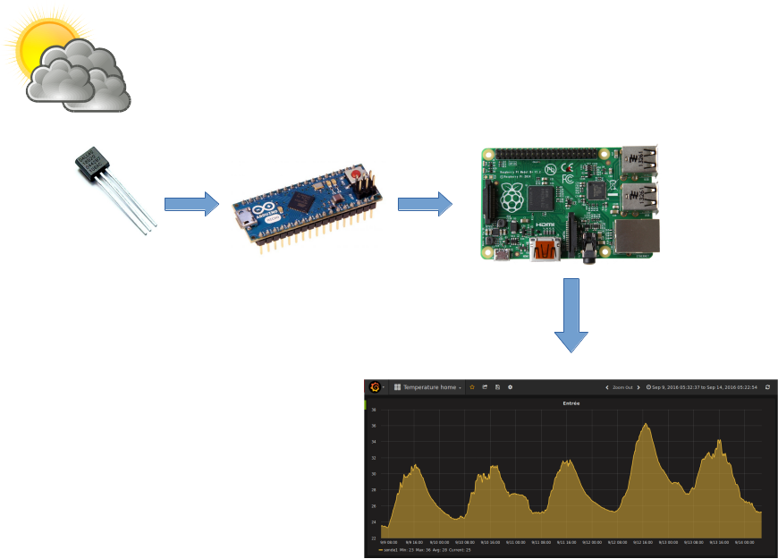

<!-- .slide:  -->

<h1 style="background: no-repeat url('ressources/pcb.jpg') !important;">
 
Construire une station&nbsp;météo en Node.js avec un Raspberry PI  et un Arduino
      
</h1>

## Vue d'ensemble

<!-- .slide: id="master-toc" class="toc" -->

<figure style="position: absolute; top: 50px; width: 100%; left: 0px;">
    
</figure>
     
*Le tout sans écrire une ligne de C !*
