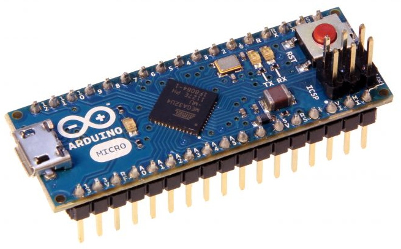
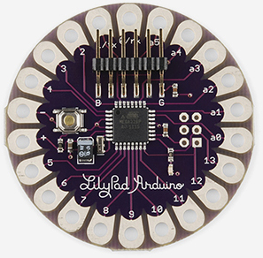
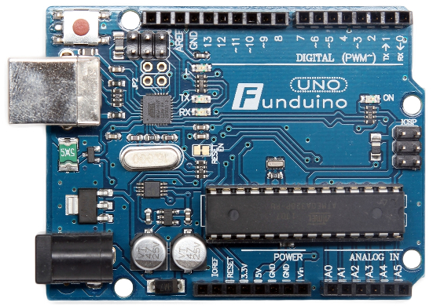
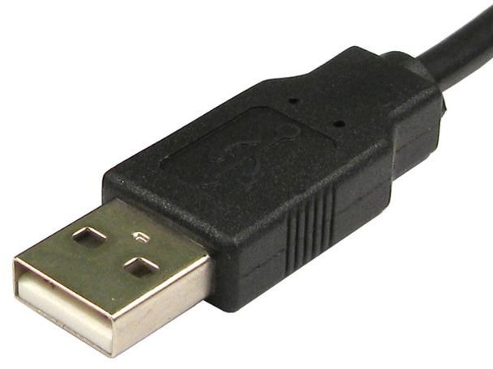

# La planète DIY

<figure style="margin-top: 300px; margin-left: 130px; width: 80%;">
    
</figure>


## Arduino : qu'est ce ?


<figure style="position: absolute; top: 350px; right: 0; width: 40%">
    
</figure>

**http://www.arduino.cc/** et **http://www.arduino.org/**
> Arduino is an open-source prototyping platform based on easy-to-use hardware and software.

<br>

- Fondé en 2008
- Caractéristiques d'un Arduino Micro
 - Microcontroleur ATMEL 8 bit @ 16 MHz
 - 32 *Ko* de Flash
 - 2.5 *Ko* de RAM + 1 *Ko* de EEPROM
 - 20x E/S numériques
 - 12x E/S analogiques


## Logiciels

- Pas de système d'exploitation
- Uniquement le programme s'exécute dessus.
- Gestion des interruptions à coder si necessaire
- Le debug se fait à coup de reboot et à la LED...
- Pas de BSOD :'(


## Raisons du succès ?
<br>

> Pour programmer un micro-contrôleur, <br>il faut un micro-contrôleur programmé...

<br>
*Problème de la poule et l'oeuf*

<figure style="margin-top: -100px; float: left; margin-left: 20%">
    
</figure>


## Solutions apportées

<figure style="position: absolute; top: 500px; right: 0; width: 30%">
    
</figure>


- Arduino intègre sur une même platine :
 - un programmateur (déjà programmé...) + un microcontroleur de "run"
 - une prise USB + des connecteurs multi-fonctions
- Shéma electronique libre
- Logiciels libres et gratuits :
  - bootloader ( &asymp; "bios/UEFI d'un PC" )
  - SDK + chaine de cross compilation + IDE simple
  - Multi plateforme
- Tarif : &asymp; 5 &rarr; 30 €


## Autres modèles & clones

- Nombreuses variantes avec plus de I/O, plus de mémoire, un processeur Intel...
- La license libre de l'ensemble à donné naissance à de nombreux clone
  - Funduino, Nanode, Freeduino

<figure style="position: absolute; top: 330px; width: 40%">
    
</figure>
<figure style="position: absolute; top: 330px; right: 0; width: 60%">
    
</figure>


## Extensions

- Shield = carte d'extension se branchant sur les pins de la carte


## Exemple de code

- Code écrit en C (*sketch*)
- *HelloWorld* = Clignotement d'une LED :

```c
void setup() {
  pinMode(13, OUTPUT); // initialisation de la pin 13 en sortie
}

// boucle infinie
void loop() {
  digitalWrite(13, HIGH);   // allume la LED (=> niveau logique 1 = +5V)
  delay(1000);              // attente d'1 seconde
  digitalWrite(13, LOW);    // éteint la LED (=> niveau logique 0 = 0V)
  delay(1000);
}
```

L'API est riche malgré les contraintes de la plateforme :

 - fonctions de lecture d'une tension, de generation de signaux basiques
 - accès aux bus matériel les plus répandu (I2C, 1 Wire...)


## Connexion

- USB avec un PC
-  Alimentation de la carte + shield
-  Port série émulé sur USB
  - Facile d'accès
  - Interopérable

<figure style="position: absolute; top: 500px; right: 0; width: 30%">
  
</figure>


## Communication serie

- Le SDK fournit des primitives pour écrire et lire sur le port serie coté Arduino
- Coté hôte, il suffit d'ouvrir un terminal serie
  - soit celui de l'IDE
  - un autre outil (```cu``` sous linux, ```screen``` sous OS X)

```c
Serial.begin(9600);
Serial.print("Hello world.");
Serial.print(78);
Serial.print(1.23456);
Serial.print('N');
```
<figure style="position: absolute; top: 370px; right: 0; width: 60%">
   
</figure>


## Comparaison avec du matériel connu


|  Plateforme | CPU                                                       | RAM  | Flash |
|-------------|-----------------------------------------------------------|------|-------|
| Arduino     | Atmel@16 Mhz                                              | 2&nbsp;*Ko* |   32&nbsp;*Ko*  |
| Rpbi 2      | Arm A7@900 Mhz Quad core                                  | 1&nbsp;Go | -     |
| Samsung S4  | Arm A15@1.6 GHz Quad&nbsp;core +<br> Arm A7@1.2 Ghz Quad&nbsp;core | 2&nbsp;Go | 16&nbsp;Go |
| MBP         | Intel i5 x86_64@2.7 Ghz Quad&nbsp;core | 8&nbsp;Go | 250&nbsp;Go |


<br>
Consommation en Idle

| Plateforme | Idle (W)  | Burn (W)
|------------|-----|-----|
| Arduino    | 0.170 (&rarr; 0.011) | 0.2 |
| Rpbi 2     | 1.1  |  4.5 |
| Tour de gamer | - | 600-1000 W |
