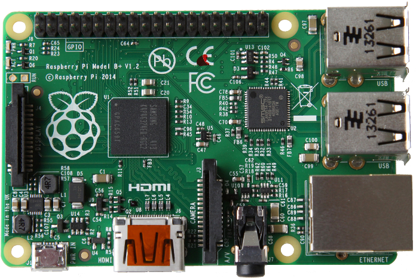

## Raspberry Pi
**http://www.raspberrypi.org**

- 1er exemplaire distribué en février 2012, 10 millions d'unités vendu
- Spécifications (modèle V2):
  - CPU Arm A7@900 Mhz Quad core
  - 1 Go de ram
  - 4xUSB 2.0
  - 1 eth 100 Mbit/s
  - gpio, port caméra, HDMI...
- Tarif : ~ 45 €
<figure style="margin-top: -300px; margin-left: 450px;  width: 60%">
    
</figure>

## OS et logiciels

- Sous linux :
  - Raspbian = port non officiel d'une debian sur *armhf*   **http://www.raspbian.org**
  - Archlinux
  - et Windows 10...
- Communauté très active
 - Le projet Raspbian produit plus de paquets que le port officiel Debian
- Compagnon idéal du bidouilleur en herbe
 - petite taille, faible consommation donc embarquable facilement
 - HTPC, robot, mangeoire d'oiseau, clusters Docker, sur laboratoire sur ISS *<i class="fa fa-space-shuttle"></i>*...

<figure style="float: right; width: 8%; margin-top: -500px">
    
    
</figure>
