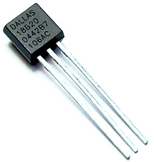

## Thermomètre

- Sonde de température *DS18B20*
- Bus *1 Wire*, développé dans les années 90
  - 3 fils (+5V, masse, data), longeur max : 100 m
  - chaque composant à une adresse unique en 64 bit
  - capteur de pression, porte logique, horloge...

<figure style="margin-left: 450px;  width: 60%">
    
</figure>


## Montage

- Montage très simple
<figure>
    
</figure>
- Sketch compliqué lié au dialogue sur le bus *1 Wire*


## Limites de l'Arduino

- L'Arduino est autonome et très peu de ressources
  - Contraintes : le programme doit tenir dans 32 Ko de flash et 1 Ko de RAM...
  - Exemples : relevé de sondes de temperatures et pilotage de radiateur, drône quadricoptère, machine enigma...
  - Connectivité avec le monde extérieur très limitée

<br>

- Dès qu'il s'agit de faire plus intelligent (robot autonome, reconnaissance de voix, graphique temps réel...) une CPU plus puissante va être nécessaire.

<br>

*<i class="fa fa-lightbulb-o" style="font-size: 150%"></i>* Utiliser un hôte qui utilise l'Arduino comme un esclave en lui émettant des ordres via le port série


## Communication série

- 1ère solution : communiquer directement avec le port serie en émettant des ordres en format texte
  - Très simple à mettre en oeuvre
  - Ultra documenté
  - Exemple de sketch : **https://gitlab.com/coliss86/arduino-controller**

```
> h
    ___          _       _
   / _ \        | |     (_)
  / /_\ \_ __ __| |_   _ _ _ __   ___
  |  _  | '__/ _` | | | | | '_ \ / _ \
  | | | | | | (_| | |_| | | | | | (_) |
  \_| |_/_|  \__,_|\__,_|_|_| |_|\___/

Help
Command available :
      h - help
      t - temperature
```


## Solution plus évoluée

- *Firmata* : **https://github.com/firmata/arduino**
  - Sketch rendant l'Arduino esclave d'un hôte
  - Communication via le port série (USB) en binaire
  - Documenté, libre et open source
  - De nombreux languages ont une lib kivabien &copy; <br>python, perl, java, php, golang, *javascript*...

- *Johnny-five* : **http://johnny-five.io/**
  - Lib NodeJS s'interfacant avec ce firmware

<br>
*<i class="fa fa-arrow-right"></i>* Le Raspberry Pi exécutera le programme en NodeJS<br> pour piloter l'Arduino

<figure style="margin-top: -350px; width: 50%; margin-right: -120px; float: right">
    
</figure>


## Johnny-five

- Hello world :

```javascript
var five = require("johnny-five");
var board = new five.Board();

board.on("ready", function() {
  var led = new five.Led(13);

  // change l'état de la LED toutes les 500 ms
  led.blink(500);
});
```


## Mise en oeuvre avec la sonde

- *Johnny-five* intègre une API de très haut niveau s'interfaçant avec de nombreux composants du marché

```javascript
board.on("ready", function() {
  var thermometer = new five.Thermometer({
    controller: "DS18B20",
    pin: 10,
    freq: 1000
  });

  thermometer.on("data", function() {
    console.log(this.celsius + "°C");
  });
});

```

Note : le code équivalent pour Arduino fait 100 lignes avec :
```C++
int16_t raw = (data[1] << 8) | data[0];
if (type_s) {
  raw = raw << 3;
  if (data[7] == 0x10) {
    raw = (raw & 0xFFF0) + 12 - data[6];
    ...
}}
```


## Graphiques

- L'objectif final est de tracer des courbes de température

- *Influxdb* : **https://www.influxdata.com/**
 - base nosql temporelle (les données sont indexées sur un timestamp précis la nanoseconde)
- *Grafana* : **http://grafana.org/**
 - Tableau de bord compatible avec de nombreuses sources de métriques
 - met en forme des données sous forme de graphique

<figure style="float: right; width: 8%; margin-top: -370px">
   
   <br>
   
</figure>

<figure>

</figure>


## Alimentation de la base

- Appel REST sur la base *Influxdb* pour ajouter périodiquement les rélevés de temperature

```javascript
var influx = require('influx');

var client = influx({host: 'raspberrypi', port: 8086, protocol: 'http', database: 'temperature', username: '', password: ''});

client.writePoint('temp', {value: valeur}, {}, function(err) {
  if (err) console.log(err);
});
```


## All together

Programme complet, lancé depuis le *Raspberry Pi* :
```javascript
var influx = require('influx');
var five = require('johnny-five');

var client = influx({host: 'raspberrypi', port: 8086, protocol: 'http', database: 'temperature', username: '', password: ''});
var board = new five.Board();

board.on('ready', function() {
  var thermometer = new five.Thermometer({
    controller: 'DS18B20',
    pin: 10,
    freq: 1000
  });

  thermometer.on('data', function() {
    console.log(this.celsius + '°C');
    client.writePoint('temp', {value: this.celsius}, {}, function(err) {
      if (err) console.log(err);
    });
  });
});
```


## All together

- *Grafana* et *Influxdb* sont déployés sous forme de conteneurs *Docker* sur le *Raspberry Pi*
<br><br>*<i class="fa fa-warning" style="font-size: 150%"></i>* Obligation de reconstruire les images from scratch car les images habituelles sont conçues pour *x86 amd64* et non *armhf*
- Montage électronique

** Ajouter photo**


## Démo

<figure style="margin-top: 0%; margin-left: 15%; width: 70%">
    
</figure>
